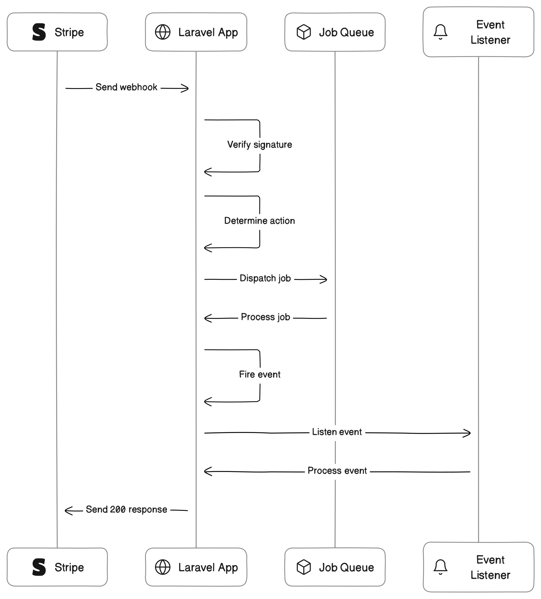

<br>

<div align="center">


</div>


<br>

<br>

<div align="center">
<a href="https://github.com/wayofdev/laravel-stripe-webhooks/actions"></a>
<a href="https://packagist.org/packages/wayofdev/laravel-stripe-webhooks"></a>
<a href="https://packagist.org/packages/wayofdev/laravel-stripe-webhooks"></a>
<a href="https://packagist.org/packages/wayofdev/laravel-stripe-webhooks"></a>
<a href="https://packagist.org/packages/wayofdev/laravel-stripe-webhooks"></a>
</div>

<br>

# Handle Stripe Webhooks in a Laravel application with Cycle-ORM integration

[Stripe](https://stripe.com/) can notify your application of various events using webhooks. This package simplifies the process of handling those webhooks. Out of the box, it verifies the Stripe signature for all incoming requests.

Once verified, all valid webhook calls will be logged to the database using [Cycle-ORM](https://github.com/cycle/orm). You can effortlessly define jobs or events to be dispatched when certain events are received by your app.

However, please note that this package only manages the initial webhook request validation and the dispatching of corresponding jobs or events.

The subsequent actions (e.g., regarding payments) should be implemented separately by the developer. Before diving into this package, it's highly recommended to familiarize yourself with [Stripe's comprehensive documentation on webhooks](https://stripe.com/docs/webhooks). 

<br>

If you **like/use** this package, please consider **starring** it. Thanks!

<br>

## 💿 Installation

### → Using Composer

Require as dependency:

```bash
$ composer req wayofdev/laravel-stripe-webhooks
```

The service provider will automatically register itself.

### → Configuring the Package

You must publish the config file with:

```bash
$ php artisan vendor:publish \
	--provider="WayOfDev\StripeWebhooks\Bridge\Laravel\Providers\StripeWebhooksServiceProvider" \
	--tag="config"
```

This is the contents of the config file that will be published at `config/stripe-webhooks.php`:

```php
<?php

declare(strict_types=1);

use WayOfDev\StripeWebhooks\Profile\StripeWebhookProfile;
use WayOfDev\WebhookClient\Entities\WebhookCall;
use WayOfDev\WebhookClient\Persistence\ORMWebhookCallRepository;

return [
    /*
     * Stripe will sign each webhook using a secret. You can find the used secret at the
     * webhook configuration settings: https://dashboard.stripe.com/account/webhooks.
     */
    'signing_secret' => env('STRIPE_WEBHOOK_SECRET'),

    /*
     * You can define a default job that should be run for all other Stripe event type
     * without a job defined in next configuration.
     * You may leave it empty to store the job in database but without processing it.
     */
    'default_job' => '',

    /*
     * You can define the job that should be run when a certain webhook hits your application
     * here. The key is the name of the Stripe event type with the `.` replaced by a `_`.
     *
     * You can find a list of Stripe webhook types here:
     * https://stripe.com/docs/api#event_types.
     */
    'jobs' => [
        // 'source_chargeable' => \App\Jobs\StripeWebhooks\HandleChargeableSource::class,
        // 'charge_failed' => \App\Jobs\StripeWebhooks\HandleFailedCharge::class,
    ],

    /*
     * The classname of the entity to be used to store webhook calls. The class should
     * be equal or extend WayOfDev\WebhookClient\Entities\WebhookCall.
     */
    'entity' => WebhookCall::class,

    /*
     * The classname of the repository to be used to store webhook calls. The class should
     * implement WayOfDev\WebhookClient\Contracts\WebhookCallRepository.
     */
    'entity_repository' => ORMWebhookCallRepository::class,

    /*
     * This class determines if the webhook call should be stored and processed.
     */
    'profile' => StripeWebhookProfile::class,

    /*
     * Specify a connection and or a queue to process the webhooks
     */
    'connection' => env('STRIPE_WEBHOOK_CONNECTION'),
    'queue' => env('STRIPE_WEBHOOK_QUEUE'),

    /*
     * When disabled, the package will not verify if the signature is valid.
     * This can be handy in local environments.
     */
    'verify_signature' => env('STRIPE_SIGNATURE_VERIFY', true),
];
```

In the `signing_secret` key of the config file you should add a valid webhook secret. You can find the secret used at [the webhook configuration settings on the Stripe dashboard](https://dashboard.stripe.com/account/webhooks).

### → Preparing the Database

By default, all webhook calls will get saved in the database.

To create the table for storing webhook calls:

1. Ensure you've already set up and are running the [wayofdev/laravel-cycle-orm-adapter](https://github.com/wayofdev/laravel-cycle-orm-adapter) package in your Laravel project.

2. Modify the `cycle.php` config to include the `WebhookCall` entity in search paths:

   ```php
   // ...
   
   'tokenizer' => [
       /*
        * Directories to scan for entities.
        */
       'directories' => [
           __DIR__ . '/../src/Domain', // Your current project Entities
           __DIR__ . '/../vendor/wayofdev/laravel-webhook-client/src/Entities', // Register new Entity
       ],
     
     	// ...
   ],
   ```

3. After updating the config, run the command to generate migrations for the new entity:

   ```bash
   $ php artisan cycle:orm:migrate
   ```

   **(Optional):** To see a list of pending migrations:

   ```bash
   $ php artisan cycle:migrate:status
   ```

4. Execute any outstanding migrations:

   ```bash
   $ php artisan cycle:migrate
   ```

### → Configuring Webhook Routing

On the [Stripe dashboard](https://dashboard.stripe.com/account/webhooks), specify the URL at which Stripe should send webhook requests. In your application's route file, map this URL using `Route::stripeWebhooks`:

```php
Route::stripeWebhooks('webhook-route-configured-at-the-stripe-dashboard');
```

Internally, this command registers a `POST` route to a controller provided by this package. As Stripe can't retrieve a csrf-token, exclude this route from the `VerifyCsrfToken` middleware:

```php
protected $except = [
    'webhook-route-configured-at-the-stripe-dashboard',
];
```

<br>

## 💻 Usage

Stripe dispatches webhooks for various event types. View the [complete list of event types](https://stripe.com/docs/api#event_types) in Stripe's official documentation.

Stripe will sign all requests hitting the webhook url of your app. This package will automatically verify if the signature is valid. If it is not, the request was probably not sent by Stripe.

Unless something goes terribly wrong, this package will always respond with a `200` to webhook requests. Sending a `200` will prevent Stripe from resending the same event over and over again. Stripe might occasionally send a duplicate webhook request [more than once](https://stripe.com/docs/webhooks/best-practices#duplicate-events). This package makes sure that each request will only be processed once. All webhook requests with a valid signature will be logged in the `webhook_calls` table. The table has a `payload` column where the entire payload of the incoming webhook is saved.

If the signature is invalid, the package will not log the request but will throw a `WayOfDev\StripeWebhooks\Exceptions\WebhookFailed` exception. Any errors that occur during a webhook call will be recorded in the `exception` column. If there's an error, a `500` response will be sent, otherwise a `200` response.

You can handle webhook requests in two ways with this package: by queuing a job or by listening to the package's events.

### → Handling Webhook Requests with Jobs

To take action when a specific event type is received, define a job. Here's a job example:

```php
<?php
  
declare(strict_types=1);

namespace Infrastructure\Stripe\Webhooks\Jobs;

use Illuminate\Bus\Queueable;
use Illuminate\Queue\SerializesModels;
use Illuminate\Queue\InteractsWithQueue;
use Illuminate\Contracts\Queue\ShouldQueue;
use WayOfDev\WebhookClient\Entities\WebhookCall;

class HandleChargeableSource implements ShouldQueue
{
    use InteractsWithQueue, Queueable, SerializesModels;

    public WebhookCall $webhookCall;

    public function __construct(WebhookCall $webhookCall)
    {
        $this->webhookCall = $webhookCall;
    }

    public function handle()
    {
        // do your work here

        // you can access the payload of the webhook call with `$this->webhookCall->payload()`
    }
}
```

To ensure prompt responses to webhook requests, consider making the job **queueable**. This allows for efficient handling of multiple Stripe webhook requests, reducing the chance of timeouts.

After creating the job, register it in the `jobs` array of the `stripe-webhooks.php` config file. The key should be the name of [the stripe event type](https://stripe.com/docs/api#event_types) where but with the `.` replaced by `_`. The value should be the fully qualified classname.

```php
// config/stripe-webhooks.php

'jobs' => [
    'source_chargeable' => \Infrastructure\Stripe\Webhooks\Jobs\HandleChargeableSource::class,
],

// ...
```

In case you want to configure one job as default to process all undefined event, you may set the job at `default_job` in the `stripe-webhooks.php` config file. The value should be the fully qualified classname.

By default, the configuration is an empty string `''`, which will only store the event in database but without handling.

```php
// config/stripe-webhooks.php

'default_job' => \Infrastructure\Stripe\Webhooks\Jobs\HandleOtherEvent::class,

// ...
```

### → Handling Webhook Requests with Events

Instead of queueing jobs to perform some work when a webhook request comes in, you can opt to listen to the events this package will fire. Whenever a valid request hits your app, the package will fire a `stripe-webhooks::<name-of-the-event>` event.

The payload of the events will be the instance of `WebhookCall` that was created for the incoming request.

Let's take a look at how you can listen for such an event. In the `EventServiceProvider` you can register listeners.

```php
/**
 * The event listener mappings for the application.
 *
 * @var array
 */
protected $listen = [
    'stripe-webhooks::source.chargeable' => [
        Infrastructure\Stripe\Listeners\ChargeSource::class,
    ],
];
```

Here's an example of such a listener:

```php
<?php

namespace Infrastructure\Stripe\Listeners;

use Illuminate\Contracts\Queue\ShouldQueue;
use WayOfDev\WebhookClient\Entities\WebhookCall;

class ChargeSource implements ShouldQueue
{
    public function handle(WebhookCall $webhookCall)
    {
        // do your work here

        // you can access the payload of the webhook call with `$webhookCall->payload()`
    }
}
```

We highly recommend that you make the event listener **queueable**, as this will minimize the response time of the webhook requests. This allows you to handle more Stripe webhook requests and avoid timeouts.

To learn about other ways to handle events in Laravel, check out [Laravel's official documentation on event handling](https://laravel.com/docs/10.x/events).

<br>

## ⚙️ Advanced Usage

### → Retry Handling a Webhook

All incoming webhook requests are written to the database. This is incredibly valuable when something goes wrong while handling a webhook call. You can easily retry processing the webhook call, after you've investigated and fixed the cause of failure, like this:

```php
use WayOfDev\WebhookClient\Contracts\WebhookCallRepository;
use WayOfDev\StripeWebhooks\Bridge\Laravel\Jobs\ProcessStripeWebhookJob;

class RetryWebhooks
{
    public function __construct(private WebhookCallRepository $repository)
    {
    }

  	public function handle()
    {
        dispatch(new ProcessStripeWebhookJob($repository->findById($id)));
    }
}
```

### → Performing Custom Logic

You can add some custom logic that should be executed before and/or after the scheduling of the queued job by using your own entity. You can do this by specifying your own entity in the `entity` key of the `stripe-webhooks`config file. The class should extend `WayOfDev\StripeWebhooks\Bridge\Laravel\Jobs\ProcessStripeWebhookJob`.

Here's an example:

```php
use WayOfDev\StripeWebhooks\Bridge\Laravel\Jobs\ProcessStripeWebhookJob;

class MyCustomStripeWebhookJob extends ProcessStripeWebhookJob
{
    public function handle(): void
    {
        // do some custom stuff beforehand

        parent::handle();

        // do some custom stuff afterwards
    }
}
```

### → Determine if a Request Should be Processed

You may use your own logic to determine if a request should be processed or not. You can do this by specifying your own profile in the `profile` key of the `stripe-webhooks` config file. The class should implement `WayOfDev\WebhookClient\Contracts\WebhookProfile`.

In this example we will make sure to only process a request if it wasn't processed before.

```php
<?php

declare(strict_types=1);

namespace WayOfDev\StripeWebhooks\Profile;

use Cycle\Database\Injection\Parameter;
use Cycle\ORM\ORMInterface;
use Illuminate\Http\Request;
use WayOfDev\WebhookClient\Contracts\WebhookProfile;
use WayOfDev\WebhookClient\Entities\WebhookCall;
use WayOfDev\WebhookClient\Persistence\ORMWebhookCallRepository;

class StripeWebhookProfile implements WebhookProfile
{
    public function __construct(private readonly ORMInterface $orm)
    {
    }

    public function shouldProcess(Request $request): bool
    {
        /** @var ORMWebhookCallRepository $webhookCallsRepository */
        $webhookCallsRepository = $this->orm->getRepository(WebhookCall::class);

        $exists = $webhookCallsRepository
            ->select()
            ->where(['name' => 'stripe'])
            ->andWhere("JSON_EXTRACT(payload, '$.id')", '=', new Parameter(['payloadId' => $request->get('id')]))
            ->count();

        return 0 === $exists;
    }
}

```

### → Handling Multiple Signing Secrets

When using [Stripe Connect](https://stripe.com/connect) you might want to the package to handle multiple endpoints and secrets. Here's how to configurate that behaviour.

If you are using the `Route::stripeWebhooks` macro, you can append the `configKey` as follows:

```php
Route::stripeWebhooks('webhook-url/{configKey}');
```

Alternatively, if you are manually defining the route, you can add `configKey` like so:

```php
Route::post(
  'webhook-url/{configKey}',
  \WayOfDev\StripeWebhooks\Bridge\Laravel\Http\Controllers\StripeWebhooksController::class,
);
```

If this route parameter is present the verify middleware will look for the secret using a different config key, by appending the given the parameter value to the default config key. E.g. If Stripe posts to `webhook-url/my-named-secret` you'd add a new config named `signing_secret_my-named-secret`.

Example config for Connect might look like:

```php
// secret for when Stripe posts to webhook-url/account
'signing_secret_account' => 'whsec_abc',
// secret for when Stripe posts to webhook-url/connect
'signing_secret_connect' => 'whsec_123', 
```

### → Transforming the Webhook Payload into a Stripe Object

You can transform the Webhook payload into a Stripe object to assist in accessing its various methods and properties.

To do this, use the `Stripe\Event::constructFrom($payload)` method with the `WebhookCall`'s payload:

```php
use Stripe\Event;

// ...

public function handle(WebhookCall $webhookCall)
{
    /** @var \Stripe\StripeObject|null */
    $stripeObject = Event::constructFrom($webhookCall->payload())->data?->object;
}
```

For example, if you have setup a Stripe webhook for the `invoice.created` event, you can transform the payload into a `StripeInvoice` object:

```php
/** @var \Stripe\StripeInvoice|null */
$stripeInvoice = Event::constructFrom($webhookCall->payload())->data?->object;

// $stripeInvoice->status
// $stripeInvoice->amount_due
// $stripeInvoice->amount_paid
// $stripeInvoice->amount_remaining

foreach ($stripeInvoice->lines as $invoiceLine) {
    // ...
}
```

<br>

## ⚡️Sequence Diagram



<br>

## 🧪 Running Tests

### → PHPUnit Tests

To run tests, run the following command:

```bash
$ make test
```

### → Static Analysis

Code quality using PHPStan:

```bash
$ make lint-stan
```

### → Coding Standards Fixing

Fix code using The PHP Coding Standards Fixer (PHP CS Fixer) to follow our standards:

```bash
$ make lint-php
```

<br>

## 🤝 License

[](./LICENSE)

<br>

## 🧱 Credits and Useful Resources

This repository is based on the [spatie/laravel-stripe-webhooks](https://github.com/spatie/laravel-stripe-webhooks) work.

<br>

## 🙆🏼‍♂️ Author Information

Created in **2023** by [lotyp / wayofdev](https://github.com/wayofdev)

<br>

## 🙌 Want to Contribute?

Thank you for considering contributing to the wayofdev community! We are open to all kinds of contributions. If you want to:

- 🤔 Suggest a feature
- 🐛 Report an issue
- 📖 Improve documentation
- 👨‍💻 Contribute to the code

